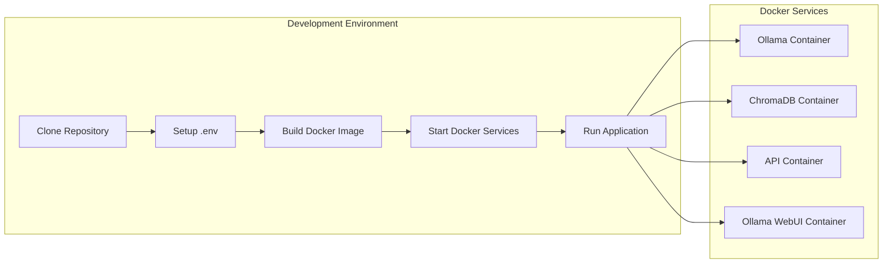

# AI Agent System - Quick Start Guide

## Overview

This AI Agent System provides a comprehensive platform for managing AI agents with tool integration, conversation memory, and real-time communication capabilities. The system is built using FastAPI and supports multiple AI models through Ollama integration.


## Quick Start

### Prerequisites

- Python 3.10+
- Docker and Docker Compose
- Git

### Installation Steps

1. **Clone the repository**
   ```bash
   git clone git@github.com:vivekratna2/pdf-chatbot.git
   cd pdf-chatbot
   ```

2. **Set up environment variables**
   ```bash
   cp .env.example .env
   # Edit .env with your configuration
   ```

3. **Build Docker Image**
   ```bash
   docker compose build
   ```

4. **Start services with Docker Compose**
   ```bash
   docker-compose up -d
   ```

   for Ollama with Docker
   ```bash
   docker-compose -f docker-compose-ollama.yml up -d
   ```

5. **Mistral installation**

   This is for the case when Ollama is hosted via docker.

   ```bash
   docker exec -it ollama ollama pull 'mistral:7b'
   ```

### Development Setup



1. **Access the application**
   - API Documentation: `http://localhost:8001/docs`


### Note
* Running Ollama service in the host machine results in faster chat response than with docker. Ollama deployed with docker uses only CPU in Macbook in the current approach.


### Demo Video
   Demo video is in the doc folder