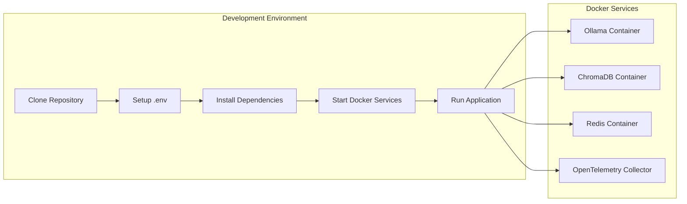

# AI Agent System - Quick Start Guide

## Overview

This AI Agent System provides a comprehensive platform for managing AI agents with tool integration, conversation memory, and real-time communication capabilities. The system is built using FastAPI and supports multiple AI models through Ollama integration.


## Quick Start

### Prerequisites

- Python 3.8+
- Docker and Docker Compose
- Git

### Installation Steps

1. **Clone the repository**
   ```bash
   git clone git@github.com:vivekratna2/pdf-chatbot.git
   cd pdf-chatbot
   ```

2. **Set up environment variables**
   ```bash
   cp .env.example .env
   # Edit .env with your configuration
   ```

3. **Install dependencies**
   ```bash
   pip install -e .
   ```

4. **Start services with Docker Compose**
   ```bash
   docker-compose up -d
   ```

### Development Setup



### Running the Application

1. **Start the FastAPI server**
   ```bash
   python -m uvicorn src.main:app --reload --host 0.0.0.0 --port 8000
   ```

2. **Access the application**
   - API Documentation: `http://localhost:8001/docs`

