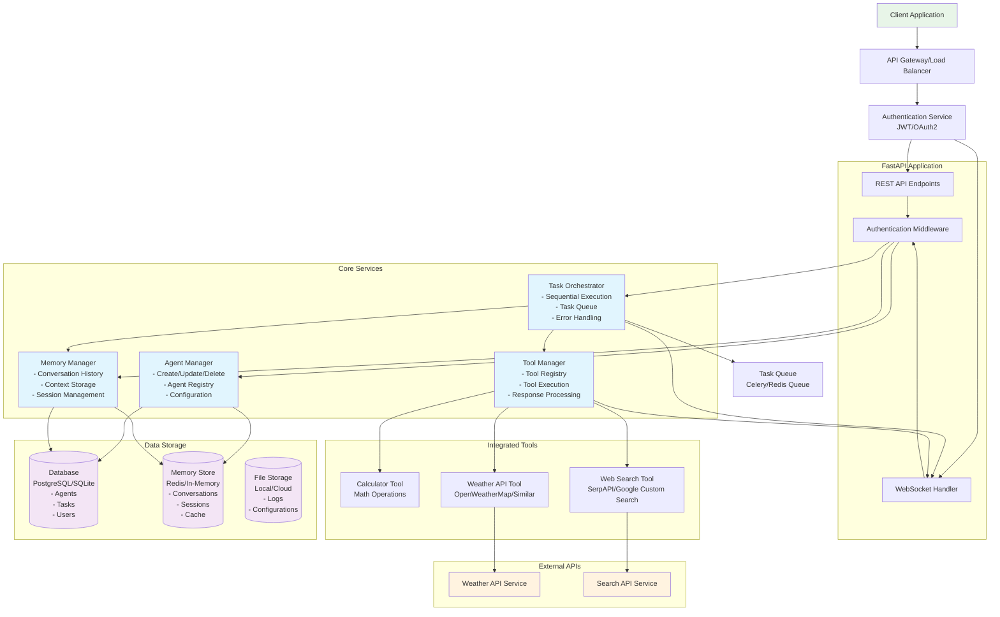

```mermaid
graph TB
    %% Client Layer
    Client[Client Application]
    
    %% API Gateway
    Gateway[API Gateway/Load Balancer]
    
    %% Authentication
    Auth[Authentication Service<br/>JWT/OAuth2]
    
    %% Main FastAPI Application
    subgraph "FastAPI Application"
        API[REST API Endpoints]
        WS[WebSocket Handler]
        Middleware[Authentication Middleware]
    end
    
    %% Core Services
    subgraph "Core Services"
        AgentManager[Agent Manager<br/>- Create/Update/Delete<br/>- Agent Registry<br/>- Configuration]
        
        Orchestrator[Task Orchestrator<br/>- Sequential Execution<br/>- Task Queue<br/>- Error Handling]
        
        MemoryManager[Memory Manager<br/>- Conversation History<br/>- Context Storage<br/>- Session Management]
        
        ToolManager[Tool Manager<br/>- Tool Registry<br/>- Tool Execution<br/>- Response Processing]
    end
    
    %% Tool Layer
    subgraph "Integrated Tools"
        Calculator[Calculator Tool<br/>Math Operations]
        Weather[Weather API Tool<br/>OpenWeatherMap/Similar]
        WebSearch[Web Search Tool<br/>SerpAPI/Google Custom Search]
    end
    
    %% Data Layer
    subgraph "Data Storage"
        Database[(Database<br/>PostgreSQL/SQLite<br/>- Agents<br/>- Tasks<br/>- Users)]
        
        MemoryStore[(Memory Store<br/>Redis/In-Memory<br/>- Conversations<br/>- Sessions<br/>- Cache)]
        
        FileStorage[(File Storage<br/>Local/Cloud<br/>- Logs<br/>- Configurations)]
    end
    
    %% External Services
    subgraph "External APIs"
        WeatherAPI[Weather API Service]
        SearchAPI[Search API Service]
    end
    
    %% Message Queue (for async tasks)
    Queue[Task Queue<br/>Celery/Redis Queue]
    
    %% Flow Connections
    Client --> Gateway
    Gateway --> Auth
    Auth --> API
    Auth --> WS
    
    API --> Middleware
    WS --> Middleware
    
    Middleware --> AgentManager
    Middleware --> Orchestrator
    Middleware --> MemoryManager
    
    AgentManager --> Database
    AgentManager --> MemoryStore
    
    Orchestrator --> ToolManager
    Orchestrator --> Queue
    Orchestrator --> MemoryManager
    
    MemoryManager --> MemoryStore
    MemoryManager --> Database
    
    ToolManager --> Calculator
    ToolManager --> Weather
    ToolManager --> WebSearch
    
    Weather --> WeatherAPI
    WebSearch --> SearchAPI
    
    %% Real-time updates
    Orchestrator --> WS
    ToolManager --> WS
    
    %% Styling
    classDef service fill:#e1f5fe
    classDef storage fill:#f3e5f5
    classDef external fill:#fff3e0
    classDef client fill:#e8f5e8
    
    class AgentManager,Orchestrator,MemoryManager,ToolManager service
    class Database,MemoryStore,FileStorage storage
    class WeatherAPI,SearchAPI external
    class Client client
```